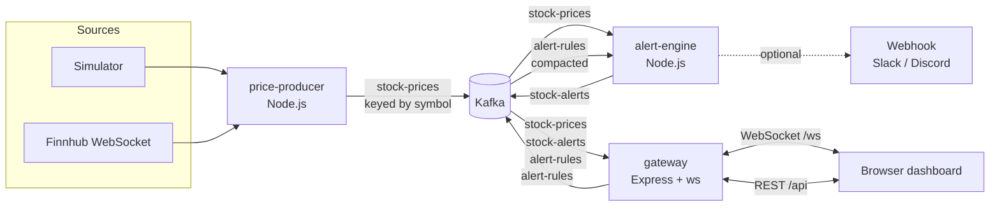

# StockMarket-Price-Tracking-System

Real-time stock price tracking built on **Kafka**, **Node.js** and **WebSockets**.
Prices stream live to a browser dashboard, you can filter by company, and you get
alerts when a price crosses a threshold you set. Everything runs with one Docker command.


## Features

- **Live price stream.** Ticks flow producer → Kafka → gateway → browser with sub-second latency.
- **Filter by company.** Each WebSocket client chooses its companies. The server only sends
  prices for those, and your selection is remembered in the browser.
- **Threshold alerts.** Rules like "TSLA rises above $250" or "AAPL falls below $220".
  An alert fires when the price *crosses* the line, not on every tick while it stays past it.
  A per-rule cooldown stops noisy prices from spamming you.
- **Alert delivery.** In-app toasts, desktop notifications, a triggered-alerts feed, and an
  optional Slack/Discord/custom webhook.
- **Durable rules.** Alert rules are stored in a compacted Kafka topic, so they survive restarts.
- **Real or simulated data.** Uses a realistic built-in simulator by default (no API key needed),
  or real trades from [Finnhub](https://finnhub.io) with `DATA_SOURCE=finnhub`.

## Architecture



| Service | Role |
|---|---|
| `price-producer` | Generates or ingests ticks and publishes them to `stock-prices`, keyed by symbol so each company's ticks stay in order. |
| `alert-engine` | Loads every rule from `alert-rules`, watches `stock-prices` for threshold crossings, and publishes to `stock-alerts` (plus the webhook, if set). Runs in a shared consumer group, so you can add engines to split the partitions. |
| `gateway` | Serves the dashboard and REST API, keeps a snapshot of recent prices, and pushes prices, alerts and rule changes to WebSocket clients according to each client's company filter. |
| `kafka` | Single-node Apache Kafka 3.9 in KRaft mode (no ZooKeeper). |

### Kafka topics

| Topic | Key | Value | Notes |
|---|---|---|---|
| `stock-prices` | symbol | price tick JSON | 3 partitions, 24h retention |
| `stock-alerts` | symbol | triggered alert JSON | 3 partitions |
| `alert-rules` | rule id | rule JSON, or `null` to delete | 1 partition, `cleanup.policy=compact` |

## Quick start (Docker)

Requirements: Docker with Compose v2.

```bash
docker compose up -d --build
```

Then open **http://localhost:8080**.

Useful commands:

```bash
docker compose logs -f alert-engine          # watch alerts being triggered
docker compose --profile tools up -d         # also start Kafka UI at http://localhost:8081
docker compose down                          # stop (alert rules are kept in the kafka-data volume)
docker compose down -v                       # stop and wipe all Kafka data
```

To change settings, copy `.env.example` to `.env` and edit it. Compose picks it up automatically.

### Using real market data

1. Get a free API key at [finnhub.io](https://finnhub.io).
2. In `.env`, set `DATA_SOURCE=finnhub` and `FINNHUB_API_KEY=your_key`. You can also set a custom
   watchlist, for example `SYMBOLS=AAPL,MSFT,NVDA,AMD`.
3. Run `docker compose up -d`.

Finnhub only streams trades while the market is open. Outside trading hours the dashboard
waits for data.

## Running the services locally (without containerising them)

Requirements: Node.js 22+. Kafka still runs in Docker and is exposed on `localhost:29092`.

```bash
npm install
docker compose up -d kafka
npm run start:producer     # terminal 1
npm run start:alerts       # terminal 2
npm run start:gateway      # terminal 3 -> http://localhost:8080
```

On Node 23 and later, kafkajs prints a harmless `TimeoutNegativeWarning`. The Docker image
uses Node 22 LTS, so the warning doesn't appear there.

Run the unit tests (alert crossing logic, subscriptions, simulator, rule validation):

```bash
npm test
```

## Configuration

| Variable | Default | Used by | Description |
|---|---|---|---|
| `KAFKA_BROKERS` | `localhost:29092` | all | Comma-separated broker list (`kafka:9092` inside Compose) |
| `DATA_SOURCE` | `simulated` | producer | `simulated` or `finnhub` |
| `FINNHUB_API_KEY` | | producer | Required when `DATA_SOURCE=finnhub` |
| `SYMBOLS` | 12 large caps | producer, gateway | Comma-separated watchlist |
| `TICK_INTERVAL_MS` | `1000` | producer | How often ticks are published |
| `ALERT_COOLDOWN_MS` | `30000` | alert-engine | Minimum time between notifications for the same rule |
| `ALERT_MAX_TICK_AGE_MS` | `60000` | alert-engine | Older ticks (a backlog after downtime) never trigger alerts |
| `ALERT_WEBHOOK_URL` | | alert-engine | POSTs `{ text, content, alert }` for each alert (works with Slack and Discord incoming webhooks) |
| `PORT` | `8080` | gateway | HTTP/WebSocket port inside the container |
| `GATEWAY_PORT` | `8080` | compose | Host port for the dashboard |
| `HISTORY_SIZE` | `120` | gateway | Price points per company sent to new clients for sparklines |
| `LOG_LEVEL` | `info` | all | `debug`, `info`, `warn`, `error` |

## REST API

| Method | Path | Description |
|---|---|---|
| `GET` | `/api/health` | Gateway status |
| `GET` | `/api/companies` | Known companies |
| `GET` | `/api/prices?symbols=AAPL,MSFT` | Latest price and recent history (all companies if `symbols` is omitted) |
| `GET` | `/api/alerts/rules` | Active alert rules |
| `POST` | `/api/alerts/rules` | Create a rule: `{ "symbol": "AAPL", "direction": "above" \| "below", "threshold": 230, "note": "optional" }` |
| `DELETE` | `/api/alerts/rules/:id` | Delete a rule |
| `GET` | `/api/alerts/history` | Recently triggered alerts |

```bash
curl -X POST localhost:8080/api/alerts/rules \
  -H "content-type: application/json" \
  -d '{"symbol":"NVDA","direction":"above","threshold":125}'
```

## WebSocket protocol

Connect to `ws://localhost:8080/ws`. Every message is JSON.

**Client → server**

| Message | Effect |
|---|---|
| `{ "type": "set-subscriptions", "symbols": ["AAPL", "TSLA"] }` | Replace your company filter (`["*"]` = all, `[]` = none) |
| `{ "type": "subscribe", "symbols": ["MSFT"] }` | Add companies to your filter |
| `{ "type": "unsubscribe", "symbols": ["AAPL"] }` | Remove companies from your filter |
| `{ "type": "create-rule", "rule": { "symbol": "AAPL", "direction": "below", "threshold": 220 } }` | Create an alert rule |
| `{ "type": "delete-rule", "id": "<rule id>" }` | Delete an alert rule |
| `{ "type": "ping" }` | Get a `pong` back |

**Server → client**

| `type` | `data` |
|---|---|
| `welcome` | `{ companies, subscriptions, rules, alerts, prices, history }`, sent on connect. New clients start subscribed to all companies. |
| `price` | A tick: `{ symbol, name, price, open, high, low, change, changePercent, volume, timestamp, source }`. Only sent for companies in your filter. |
| `snapshot` | `{ prices, history }` for companies you just subscribed to |
| `subscriptions` | `{ symbols }`: your filter after a change |
| `alert` | `{ symbol, direction, threshold, price, previousPrice, message, triggeredAt, ... }`. Sent to every client. |
| `rule-saved` / `rule-deleted` / `rule-created` | Changes to alert rules |
| `companies` | Updated company list, sent when a new symbol appears |
| `error` | `{ message }` |

## Project layout

```
├── docker-compose.yml       Kafka + the three Node services (+ optional Kafka UI)
├── Dockerfile               One image; Compose picks the entrypoint per service
├── public/                  Dashboard (vanilla JS, no build step)
├── src/
│   ├── config.js            Environment-based configuration
│   ├── lib/                 Kafka helpers (topics, compacted-topic replay), logger
│   ├── shared/              Company reference data, alert rule validation
│   ├── producer/            price-producer service + simulated/Finnhub sources
│   ├── alerts/              alert-engine service + crossing evaluator
│   └── gateway/             WebSocket/REST gateway, subscription registry, market state
└── test/                    node:test unit tests
```

## Disclaimer

Simulated prices are randomly generated and are not real quotes. This project is for
educational purposes and is not financial advice.
